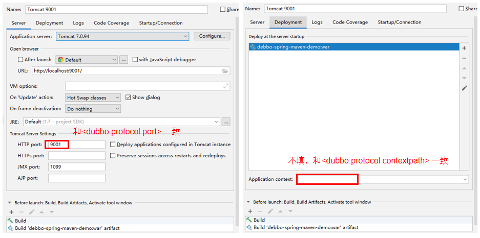

本项目是用 Dubbo 2.6.0 搭建的 REST 风格项目，使用 IDEA + Tomcat 启动本项目，或打包成 war 后发布到 Tomcat 下的 ROOT 文件夹。

运行前确保本地zookeeper已经启动。

配置文件：src/main/resources/provider-context.xml，项目 build 成功之后将会出现target文件夹。

IDEA目录结构如下（默认是json）:

Tomcat配置如下：

运行成功可以本地访问：http://localhost:9001/system/serverIpList ，（也可以添加.json或.xml后缀，显式指明需要请求的数据模式），浏览器运行结果如下：

- 默认json格式：

- 指定xml格式：

